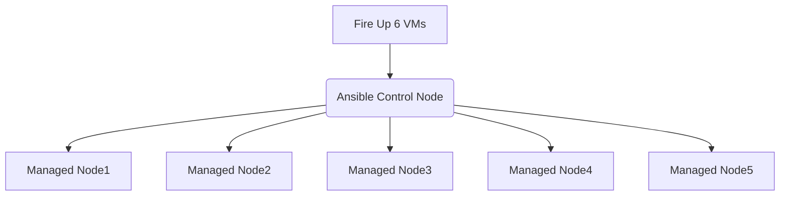

# Ansible Setup for RHCE EX294

This is a sample Ansible exam that I’ve created to prepare for the new RHCE exam EX294. As with the real exam, no perfect answers to the sample exam questions will be provided, but more or less correct and accurate. 

- You may opt for the Official Red Hat Ansible Lab, which is free, but <u>you will be limited to 4 VMs</u>.

## Requirements

There are 18 questions in total could be more or less.
You will need six RHEL 9 virtual machines to be able to successfully complete all the questions.

One VM will be configured as an Ansible control node. The other five VMs will be used to apply playbooks to solve the sample exam questions. The following FQDNs will be used throughout the sample exam.

| FQDN                      | Description                            | IP Address              |
| ------------------------- | -------------------------------------- | ----------------------- |
| control.example.com       | Ansible control node                   | 172.28.128.100          |
| node1.example.com         | managed host                           | 172.28.128.101          |      
| node2.example.com         | managed host                           | 172.28.128.102          |
| node3.example.com         | managed host                           | 172.28.128.103          |
| node4.example.com         | managed host                           | 172.28.128.104          |
| node5.example.com         | managed host                           | 172.28.128.105          |



## Lab Setup

> You can create the lab setup manually, but instead I've created a [Virtualbox Vagrantfile](https://github.com/RedHatRanger/RHCE9Vagrant/tree/main/Vagrantfiles/virtualbox) which you can use in order to create this setup automatically. The Ansible user is "rhel" and the password is "redhat". Once you are done, you can go here: [Virtualbox Start Point](https://github.com/RedHatRanger/RHCE9Vagrant/blob/main/rhce-practice-questions/01_configure_ansible_(MEDIUM).md#configure-ansible)

## Q1. Ansible Installation and Configuration

- Install the ansible package on the control node
- Create "rhel" user with "redhat" password
- You have root access to all five servers
- the `rhel` user should be allowed to execute any command without providing password to the prompt "Add the rhel user to sudoers group"
- Create inventory on the control node at /home/rhel/ansible-files/inventory. Meet following requirements:

  - `node1` should be a member of the `dev` host group
  - `node2` should be a member of the `test` host group
  - `node3` should be a member of the `prod` host group
  - `node4` should be a member of the `prod` host group
  - `node5` should be a member of the `balancers` host group
  - The `prod` group should be a child group of the `webservers` group

- Create a config file at `/home/rhel/ansible-files/ansible.cfg` with following requirements:
  - privileged escalation is disabled by default
  - ansible should manage 8 hosts at a single time
  - use previously defined inventory file by default
  - uses `/var/log/ansible/execution.log` to save information related to playbook execution
  - roles path should include `/home/rhel/ansible-files/roles`
  - ensure that priviledge escalation method is set to sudo
  - do not allow ansible to ask for password when elevating privileges

## A1. Ansible Installation and Configuration

> Before you actually start with installing ansible it's better to Check your `/etc/hosts` file which resolves host ip address to FQDNs, in RHCE exam they will give you all the FQDN of managed nodes and you don't need to create an entry in `/etc/hosts` file, Remember that **You have root access to all five servers**, in my exam it was already created. what i mean is this file was created already `/etc/hosts` and hosts file was already being populated with ip addresses and hostnames along with FQDNs, and i didn't have to create them from scratch.

> just an example so you know how they will provide you `/etc/hosts` file

```shell
[root@control ~]# cat /etc/hosts
127.0.0.1 localhost localhost.localdomain localhost4 localho    st4.localdomain4
::1 localhost localhost.localdomain localhost6 localhost6.lo    caldomain6

172.28.128.100   control.example.com   node1
172.28.128.101   node1.example.com     node1
172.28.128.102   node2.example.com     node2
172.28.128.103   node3.example.com     node3
172.28.128.104   node4.example.com     node4
172.28.128.105   node5.example.com     node5

# and you can access nodes via ssh command
[rhel@control ~]# ssh node1
```

> There could be 5 managed nodes or 4 managed nodes, it doesn't matter actually, in the real exam it will be clearly defined and you can always check via `cat /etc/hosts` from the control node.

> You will have to connect to control node via ssh, the examiner would tell you the user that you will connect as to your control node which could be `lisa` or `matthew`, it doesn't matter, please don't be nervous.

```shell
ssh rhel@control
```

```
172.28.128.100  control.example.com  control
172.28.128.101  node1.example.com    node1
172.28.128.102  node2.example.com    node2
172.28.128.103  node3.example.com    node3
172.28.128.104  node4.example.com    node4
172.28.128.105  node5.example.com    node5
```

> This step is not part of your RHCE exam, I just want to show you how you would actually copy your public key to managed nodes. As the 'rhel' user, generating ssh key and copy it to the managed hosts:

```
[rhel@control ~]$ ssh-keygen -t rsa -b 4096
[rhel@control ~]$ for i in {1..5}; do ssh-copy-id node${i}; done
```

- step1: Installing the ansible

> In the real exam you would need to install ansible if it's installed already.

> Remember, in the real exam RHCE-294 you will be using `ansible version 2.9` or `2.8` so you will not have to use `fully qualified collection name`. in simple words, when you use ansible modules while writing ansible playbooks, you won't need to write a long name of the module `ansible.builtin.copy` but you could simply use `copy`. the reason behind this is `ansible 2.13` contains a lot of modules that were created by people from all around the world, and the only way to `differentiate between these modules` is actually by using `white-spaces` like `long names`. imagine the case if you want use a `networking module` and you want to use for example `cisco.os.bla.bla` another module could be called `cisco.os.os` as well, and if you wrote the name of the module `cisco.os` inside a playbook `ansible won't be able to fetch the right module from preinstalled collections`.

> besides, you need to know that, while studying for exam, you could be using `ansible 2.13 version` from `ansible-core` and it could be difficult for you to install the right version of ansible. so, using `ansible 2.13 version` which is a little complicated due to `fQCN`.
> you need to make sure you install additional collections as well because you won't find modules like `parted` or `firewalld` installed by default as in the case of `ansible 2.9`. furthermore, to have these modules `parted` and `firewalld` while using `ansible 2.13` you need to install them via `ansible-galaxy collection install community.general`. moreover, in `ansible 2.9` modules were all in one package, i.e. all modules like `firewalld`, `parted`, and `networking modules` were all part of one package which is not good for long term development plan, these modules are being developed constantly and more modules were added and ansible package was getting larger and larger and clearly Redhat had to decide to keep everything in one package or decouple modules.

> Remember, Redhat acquaired ansible long ago. from 2015 to be exact, and so they have full right to ansible, and they can change how ansible is being configured and distributed. so from `ansible 2.10` onwards Redhat decided to decouple ansible modules, meaning in the past everything used to be placed inside one package. `just remember that RHCE-294 exam is testing you in ansible 2.9` . and after that, `ansible 2.10` and onwards where you find modules are being separated inside different packages, and the only way to bring them to your workspace is to install them via `ansible-galaxy` command.

> General thought, i think Redhat has made a good decision because now you only install the necessary packages to get the job done, instead of installing everything and you may not need to use some unnecessary modules.

```
[root@control ~]# yum install -y ansible
```

- step2: Configuring the user account

> Create an account, note that in the real exam the user will be already created for you and it will be given proper privileges too via `sudo` command

```
[root@control ~]# useradd rhel
```

> Set password, in the real exam this step will also be done for you by default and you will not need to configure a password, and please don't create a password for the already created user.

```
[root@control ~]# echo "rhel:redhat" | chpasswd
```

- step3: Allow access to privileged commands

> note that in the real exam the user will be already created for you and it will be given proper privileges too via the `sudo` command

```
[root@control ~]# echo "rhel ALL=(ALL) NOPASSWD:ALL" > /etc/sudoers.d/rhel
```

- step4: Creating inventory

> Create directory for the inventory, this step is part of your exam

```shell
mkdir -p /home/rhel/ansible-files/
mkdir -p /home/rhel/ansible-files/roles
sudo mkdir -p /var/log/ansible/
sudo touch /var/log/ansible/execution.log

# Next, we create the inventory
vim /home/rhel/ansible-files/inventory
```

> Create the inventory with following contents, this step is part of your exam

```
[dev]
node1

[test]
node2

[prod]
node3
node4

[balancers]
node5

[webservers:children]
prod
```

> Save it to `/home/rhel/ansible-files/inventory`

- step5: Create the config file with following content

> Create the ansible.cfg `ansible configuration file` with following contents

> you don't need to define `forks` or `log_path` I just included them anyway.

> if you forgot how to write the `ansible.cfg` file you can always use this command to instantiate ansible.cfg file with all possible configuration but this file content will be commented. hence, --disabled.

```shell
ansible-config init --disabled > ansible.commented
# then delete the unnecessary lines manually or use "/remote_user" to quickly find what you need and delete the rest.
```

```
[defaults]
remote_user=rhel
inventory=/home/rhel/ansible-files/inventory
roles_path=/home/rhel/ansible-files/roles
collections_path=/home/rhel/ansible-files/mycollections
ask_pass=false
host_key_checking=false
#callbacks_enabled=profile_tasks
#log_path=/var/log/ansible/execution.log
#forks=8

[privilege_escalation]
become=true
become_medthod=sudo
become_user=root
become_ask_pass=false
```

> Save it to `/home/rhel/ansible-files/ansible.cfg`

## Ad-Hoc Commands

Generate an SSH keypair on the control node. You can perform this step manually.

- Write a script `/home/rhel/ansible-files/adhoc` that uses Ansible ad-hoc commands to achieve the following:
  - User rhel is created on all inventory hosts (not the control node).
  - SSH key (that you generated) is copied to all inventory hosts for the rhel user and stored in `/home/rhel/.ssh/authorized_keys`.
  - The rhel user is allowed to elevate privileges on all inventory hosts without having to provide a password.

> **After running the adhoc script on the control node as the rhel user, you should be able to SSH into all inventory hosts using the rhel user without password, as well as a run all privileged commands.**

> this question helps you in setting up ansible lab but not necessarly part of your exam. this question regarding configuring ssh key and public key and copy the key to managed nodes, will not be part of your exam because they already configured the root access to all managed nodes, but instead a similar question about configuring local repository using ad-hoc commands and bash-scripting could be asked. Please go to the following exam question for clarity.

- step1: you should test ansible adhoc commands before writing the bash script, the command `ansible localhost -m ping` is usefull, use it few times against target hosts to verify connectivity

- step2: you should read and understand the inventory file, if you haven't wrote your inventory by yourself, then you can check the inventory file in this repository.

```shell
#!/bin/bash
# Create the directory for ssh keys.
ansible localhost -m file -a "path=/home/rhel/.ssh state=directory"
# Generate the ssh keys.
ansible localhost -m openssh_keypair -a "path=/home/rhel/.ssh/id_rsa owner=rhel group=rhel type=rsa"
# Create rhel user on managed nodes.
ansible all -m user -a "name=rhel password={{ 'redhat' | password_hash('sha512') }}"
# share public key to managed nodes, remember to check your ansible.cfg configuration because this command needs sudo privileges.
ansible all -m authorized_key -a "key={{ lookup('file', '/home/rhel/.ssh/id_rsa.pub') }} user=rhel state=present"
# Add the rhel user in each managed node to sudoers group for privilege escalation.
ansible all -m copy -a "content='rhel ALL=(root) NOPASSWD:ALL' dest=/etc/sudoers.d/rhel"
```

## Similar Question

> this question is certainly coming in the exam.

Because you will have to install software on the managed hosts, you need to do the following:

- Create a shell script with the name `packages.sh` that runs an Ansible ad-hoc command to create a yum repository on all managed hosts using the information as below:

- The Appstream base URL and BaseOS URL are `http://repo.example.com/AppStream` and `http://repo.example.com/BaseOS`

- The Appstream and BaseOS description are `Appstream` and `BaseOS`

- The Appstream and BaseOS names are `Appstream` `BaseOS`

- The repositories must be enabled with a gpgkey of `http://repo.example.com/RPM-GPG-KEY-redhat-release`

## Answer

> you can use Ansible-doc to help you convert a task into a ad-hoc command that could be part of bash-script file `ansible-doc yum_repository`.

> Remember even a single typo could cost you a full mark on this question, make sure you use quotation around your description parameters.

```shell
#!/bin/bash

ansible all -m yum_repository -a "name=BaseOS description='BaseOS' baseurl=http://content/rhel9.4/x86_64/dvd/BaseOS gpgcheck=yes gpgkey=http://content/rhel9.4/x86_64/dvd/RPM-GPG-KEY-redhat-release enabled=yes"

ansible all -m yum_repository -a "name=AppStream description='AppStream' baseurl=http://content/rhel9.4/x86_64/dvd/AppStream gpgcheck=yes gpgkey=http://content/rhel9.4/x86_64/dvd/RPM-GPG-KEY-redhat-release enabled=yes"
```

> Please if you have reached this far, know that you are awesome and please star my repository as token of appreciation and support.

> all the question listed in this repo is nothing but a collection of what I've personally encountered during my own exam as well as what i've seen on the internet. in addition, all my solutions are good but not super accurate because no one knows the model answer of the exam, and please try to write simple playbooks don't try to use `when` clause in a very chunky way you still can write longer playbook and target specific hosts which i think is much better aims for readability. but i've tried my best to bring as many questions as possible which could help you ace your exam, Please Don't try to memorize them but think of them as a tool which could help you prepare for the real exam, remember if you are not prepared well a slight change in the question could really make you nervous and clueless during the exam and lead you away from the correct answer. so, you need to make sure you know ansible very well before attempting RHCE-294 exam, i wish you all the very best ^.^

The groups parameter, when used with the append parameter, tells the machine to append
the supplementary groups sys_admins and developers to this user. If you do not use
the append parameter then the groups provided overwrite a user's existing supplementary
groups. To set the primary group for a user, use the group option.

The following example task mounts the NFS share available at 172.25.250.100:/share on the
/nfsshare directory on the managed hosts.
```
---
- name: Mount NFS share
  ansible.posix.mount:
    path: /nfsshare
    src: 172.28.128.100:/share
    fstype: nfs
    opts: defaults
    dump: '0'
    passno: '0'
    state: mounted
```
